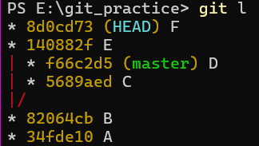
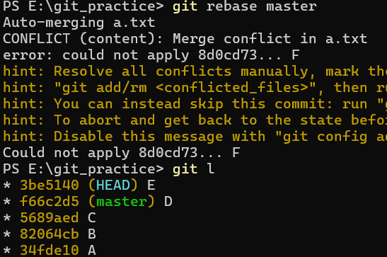
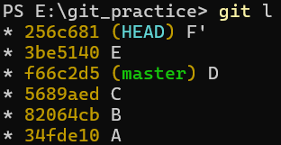
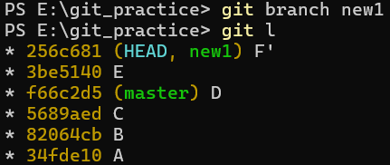
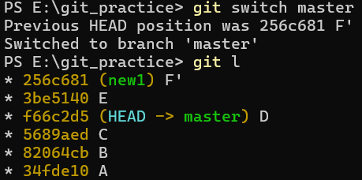
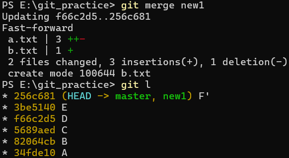

- ### HEAD
  - HEAD는 본인의 현재 위치를 가리키는 포인터이다.
- ### detached HEAD
  - **일반적으로 HEAD는 main, debug등의 브랜치를 가리키지만, HEAD가 특정 커밋을 직접적으로 가리키는 경우를 detached HEAD라고 한다.**
    
    1.  일반적인 commit 그래프  
        
    2. 커밋 B로 checkout  
        
    3. detached 상태의 log와 branch 출력  
         

- ### detached 상태에서의 작업
  - **커밋 생성**
      1. detached 상태에서 작업 후 커밋 생성  
            

      2. 현재 커밋 E는 detached HEAD 상태에서 생성된 유령 커밋이다.  
         이를 보존하기 위해서는 새로운 브랜치를 생성해야 한다.  
           
      3. 혹은 이미 다른 브랜치로 이동한 경우 커밋 해시를 이용해 새로운 브랜치를 붙여줄 수 있다.
          
  - **rebase**
    1. detached 상태의 커밋 위에 있는 상황  
      
    2. master 브랜치로 rebase 실행 중 충돌 발생  
      
    3. 충돌을 해결하고 rebase로 인해 D 이후에 커밋 E,F'이 생성됐다. (충돌이 있었던 것을 표시하기 위해 F를 F'으로 수정)  
    하지만 아직 커밋 F'을 가리키는 브랜치는 없는 상태이다.  
      
    4. 이때 `git branch <브랜치>` 명령어를 사용해 F'을 브랜치에 속하게 해준다.  
    
    5. 이제 master 브랜치로 이동 후  
    
    6. F'이 있는 브랜치를 Fast-Forward merge하면 rebase가 완료된다.  
      이후 작업에 따라 new1 브랜치를 삭제하거나 계속 사용할 수 있다.  
    
    - detached HEAD 상태에서 작업을 하며 커밋을 하게 됐다면 자유롭게 이동할 수 있게 빨리 브랜치를 만들어 사용하는 것이 바람직하다.
    - 만약 위의 예시처럼 rebase를 하는 상황이라면 master 브랜치를 F'으로 이동시키는 다른 방법도 있다.
      - master 브랜치로 이동 후 `git reset --hard <커밋해시>`을 사용하거나  
      - `git branch -f master <커밋해시>`를 사용할 수 있다.  
    - 그러나 아직 HEAD는 브랜치가 아닌 F' 커밋을 가리키는 detached 상태이기 때문에 새 브랜치를 만들거나 master 브랜치로 이동하는 것이 바람직하다.

     

- ## AI정리
  - ### Detached HEAD (분리된 HEAD) 완벽 이해
    - Git에서 HEAD는 본인의 현재 위치를 가리키는 포인터입니다. 평소에 HEAD는 특정 커밋을 직접 가리키지 않고 main이나 dev 같은 '브랜치 이름표'를 가리킵니다.  
    하지만 이 HEAD가 브랜치 이름표를 잃어버리고 특정 커밋에 맨몸으로 떨어져 있는 상태를 Detached HEAD라고 합니다.  
    - 🔍 언제, 어떻게 발생하는가?  
    가장 대표적으로 과거의 특정 시점으로 돌아가기 위해 커밋 해시를 직접 입력할 때 발생합니다.  
    특정 커밋의 상태로 덮어쓰기 위해 git checkout <커밋> 명령어를 사용하면, Working Directory, Staging Area, Repository가 모두 해당 커밋 상태로 바뀌게 됩니다.  이때 HEAD는 브랜치를 떠나 과거의 특정 커밋을 직접 가리키게 되며 Detached HEAD 상태로 진입합니다.
    - ⚠️ 왜 위험한가? (발생하는 문제)  
    이 상태에서도 코드를 수정하고 커밋을 생성할 수는 있지만, 생성된 커밋을 붙잡아줄 브랜치 이름표가 없습니다.  
    **수정만 하고 이동할 때**: 커밋하지 않고 git checkout <브랜치>로 다시 돌아오면, 작업 중이던 수정 내역을 함께 가져오게 됩니다.  
    **커밋 후 이동할 때 (유실 발생)**: 만약 수정을 마치고 커밋을 한 뒤 바로 다른 브랜치로 돌아오면, 이름표가 없는 해당 커밋은 허공에 붕 뜨게 되어 결국 소실됩니다.  
    - 💡 완벽한 해결 및 보존 방법  
    Detached HEAD 상태에서 만든 소중한 커밋을 유지하려면 반드시 브랜치를 생성해야 합니다.  
    **작업 및 커밋 완료**: 과거 시점에서 코드를 수정하고 git commit을 완료합니다.  
    **새 브랜치 생성 및 연결**: git switch -c <새로운_브랜치명> (또는 git checkout -b <새로운_브랜치명>) 명령어를 입력합니다.  
    **결과**: 방금 만든 유령 커밋에 새로운 이름표가 부여되며, 정식 히스토리로 안전하게 저장됩니다.