- [예제](#예제)

- ## AI 개념 정리
  - ### Pull Request(PR)
    - 내가 작업한 브랜치의 코드를 기준 브랜치로 가져가서 병합해 달라고 요청하는 것
    - PR은 Git 자체의 내장 명령어가 아니라, GitHub, Bitbucket 등 원격 호스팅 플랫폼에서 제공하는 협업 기능이다.  
      GitLab에서는 동일한 기능을 **Merge Request (MR)** 라고 부른다.

  - ### Pull Request의 주요 목적
    1. **코드 리뷰 (Code Review):** 코드를 병합하기 전 동료들에게 시각적으로 보여주고 피드백을 주고받는다.
    2. **안전성 확보:** 검증되지 않은 코드가 핵심 브랜치에 직접 Push되는 것을 막는 안전장치 역할을 한다.
    3. **히스토리 보존:** 코드 수정 이유와 논의 과정을 기록으로 남겨, 프로젝트의 맥락을 유지한다.

  - ### 권한에 따른 PR 워크플로우 차이
    - **원본 저장소에 쓰기 권한이 있을 때 (사내 팀 프로젝트)**
      - 원본 저장소를 Clone ➡️ 브랜치 생성 및 작업 ➡️ **원본 저장소로 Push** ➡️ PR 생성
    - **원본 저장소에 쓰기 권한이 없을 때 (오픈소스 기여)**
      - 원본 저장소를 내 계정으로 **Fork(복제)** ➡️ Fork한 내 저장소를 Clone ➡️ 브랜치 생성 및 작업 ➡️ **내 저장소로 Push** ➡️ 원본 저장소로 PR 생성

- ## 예제

  - ## Pull Request 생성
    - ### 원본 저장소에 쓰기 권한이 **있는** 경우
      1. 새로운 브랜치에서 작업 후 커밋 생성 및 push.  
        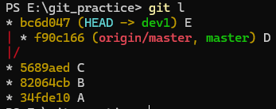  
        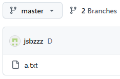  
        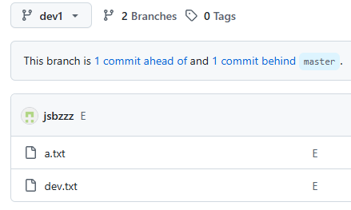
      2. dev1에서 master로의 pull request생성  
        - push 직후  
          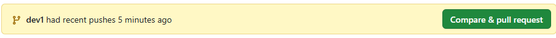
        - push 이후 pull request 생성 방법
          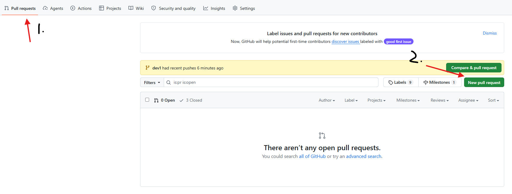
          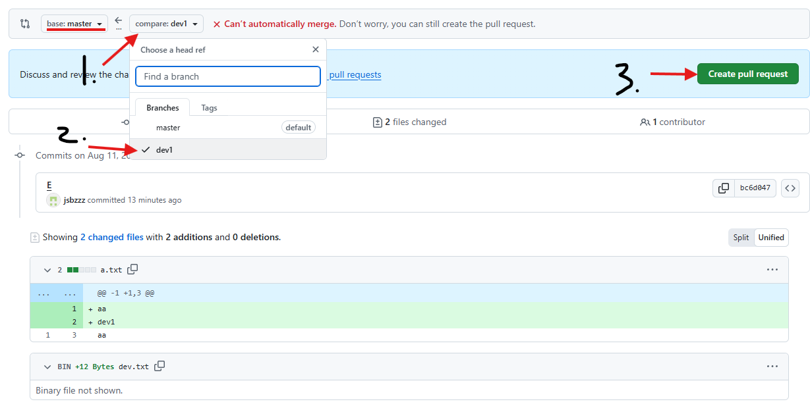
          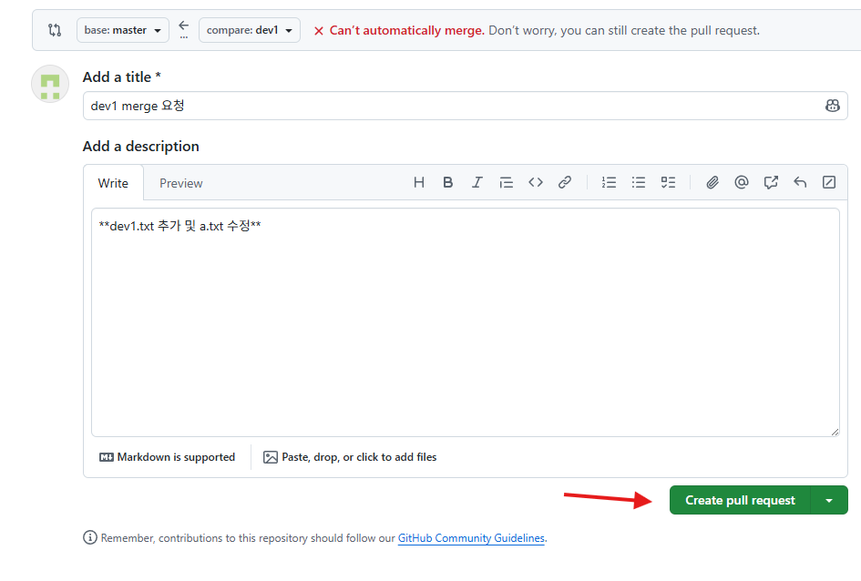
      3. pull request가 생성된 모습  
        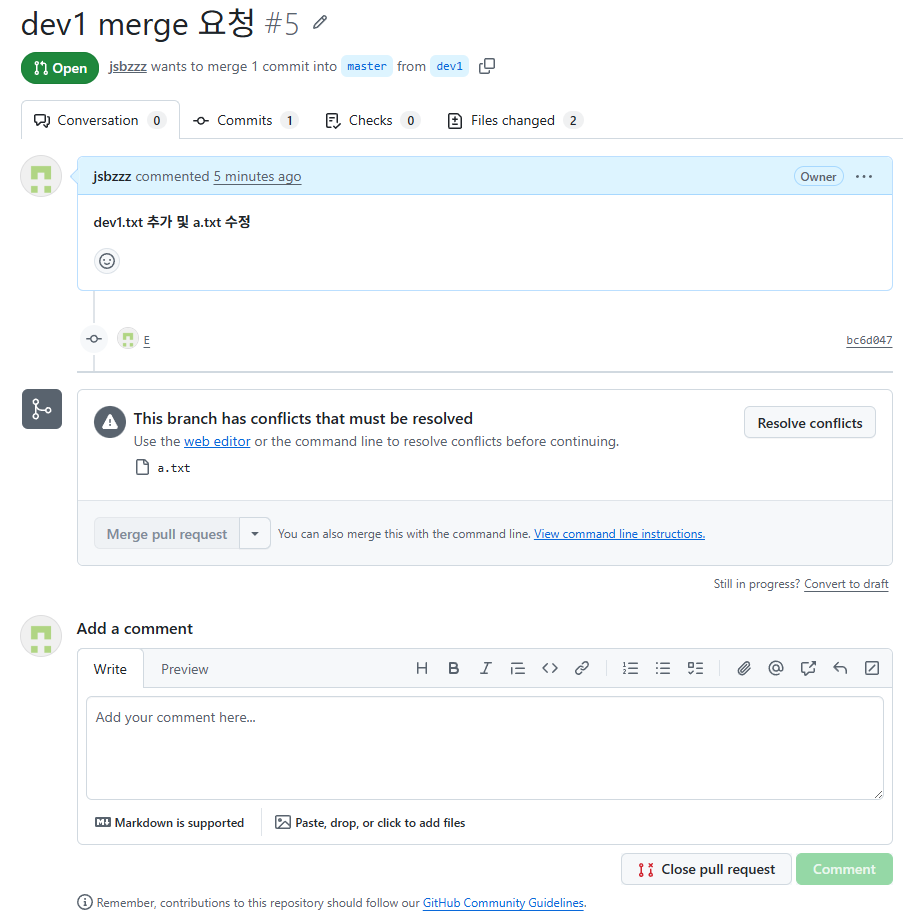

    - ### 원본 저장소에 쓰기 권한이 **없는** 경우
      1. 원본 저장소를 fork해 가져온다. 
      
      
      
      2. fork된 저장소를 clone해 로컬에서 작업 후 push  
        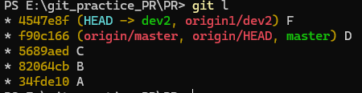
        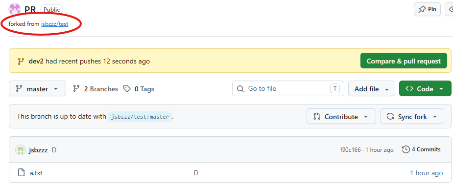
      3. 원본 저장소에 작업한 브랜치로 pull request 생성
        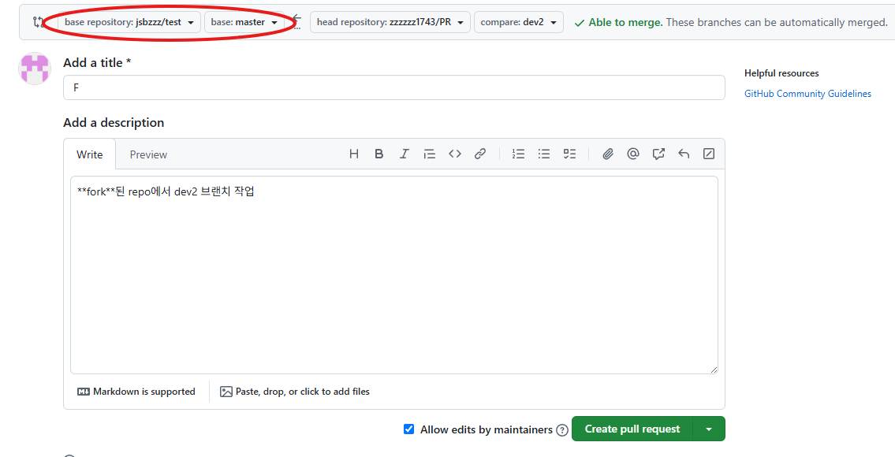  

          경우에 따라 **fork된 저장소** 자체에 pull request를 생성할 수도 있다.
          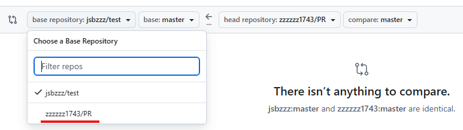

  - ## 관리자의 Pull Request 수락
    - 충돌이 없는 상황
      1. pull request 목록에서 선택 후 코멘트를 남기거나 merge 옵션 선택 후 merge  
        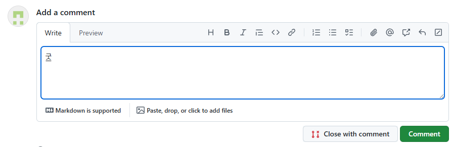
        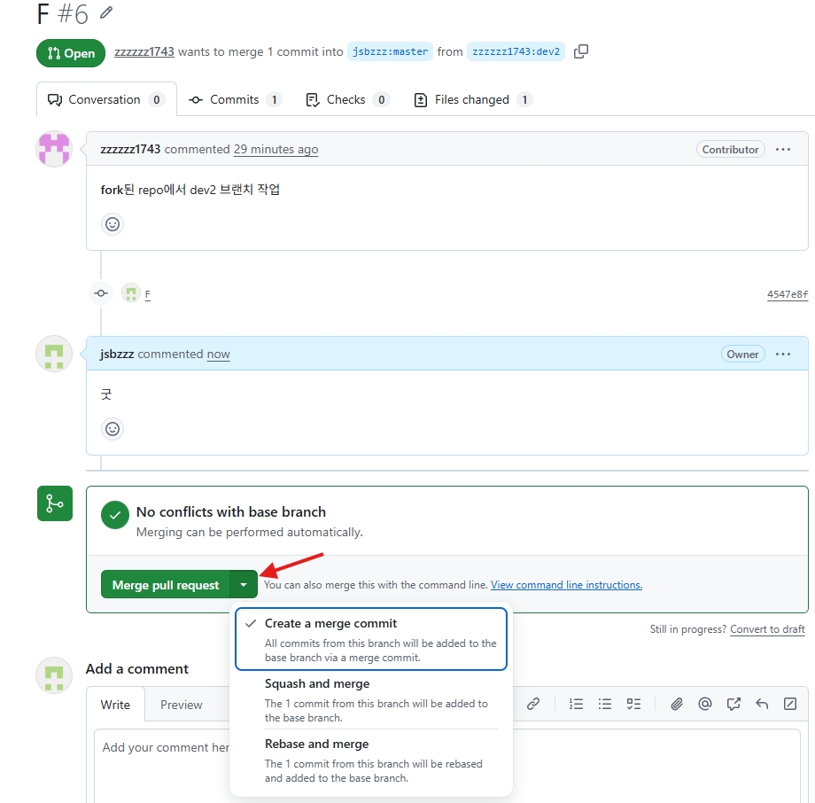
        머지 커밋 생성 선택 시 커밋 메시지 및 설명 추가 가능
        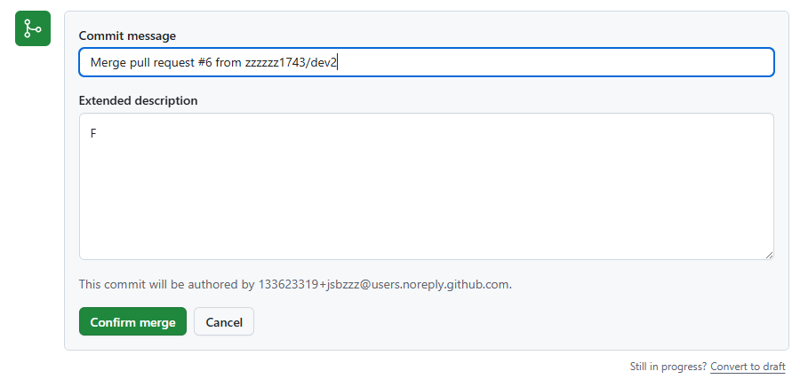
      2. 성공적으로 merge된 상태  
        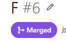  
        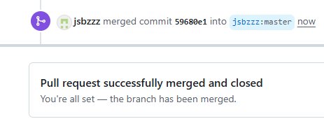  
        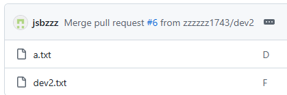  
        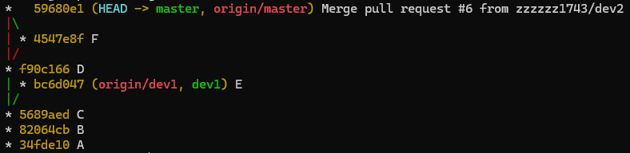

    - 충돌이 있는 경우  
      1.  